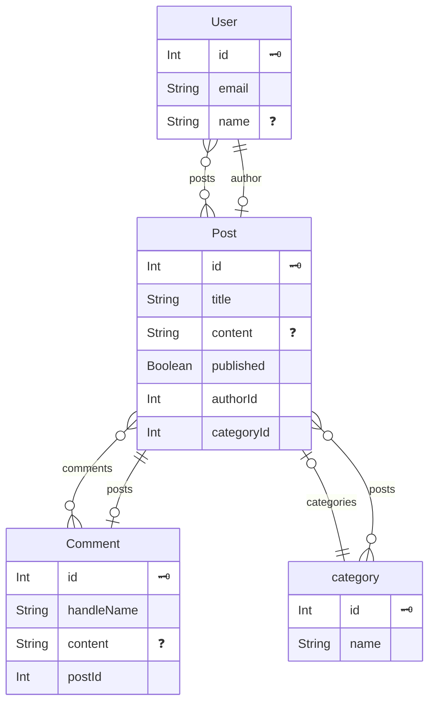

```mermaid
erDiagram

  "User" {
    Int id "🗝️"
    String email 
    String name "❓"
    }
  

  "Post" {
    Int id "🗝️"
    String title 
    String content "❓"
    Boolean published 
    Int authorId 
    Int categoryId 
    }
  

  "Comment" {
    Int id "🗝️"
    String handleName 
    String content "❓"
    Int postId 
    }
  

  "category" {
    Int id "🗝️"
    String name 
    }
  
    "User" o{--}o "Post" : "posts"
    "Post" o|--|| "User" : "author"
    "Post" o{--}o "Comment" : "comments"
    "Post" o|--|| "category" : "categories"
    "Comment" o|--|| "Post" : "posts"
    "category" o{--}o "Post" : "posts"
```
