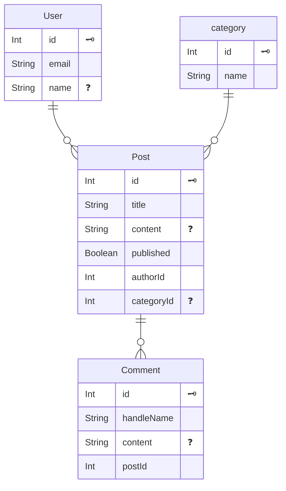

```mermaid
erDiagram

  "User" {
    Int id "🗝️"
    String email
    String name "❓"
    }


  "Post" {
    Int id "🗝️"
    String title
    String content "❓"
    Boolean published
    Int authorId
    Int categoryId "❓"
    }


  "Comment" {
    Int id "🗝️"
    String handleName
    String content "❓"
    Int postId
    }


  "category" {
    Int id "🗝️"
    String name
    }

    "User" ||--}o "Post" : ""
    "Post" ||--}o "Comment" : ""
    "category" ||--}o "Post" : ""
```
